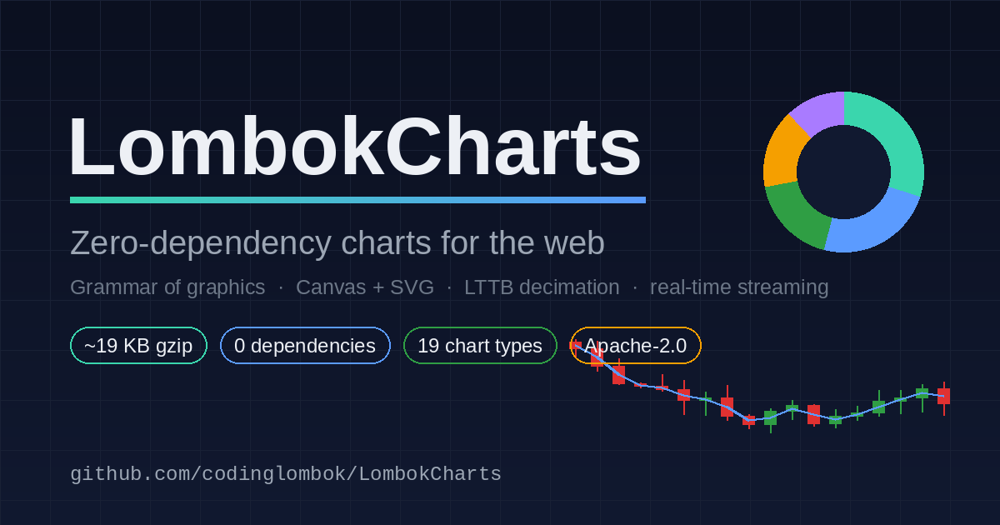
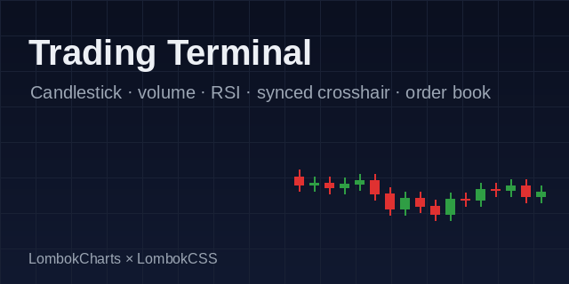
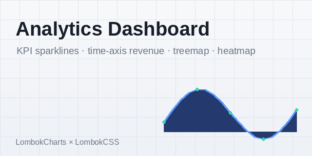
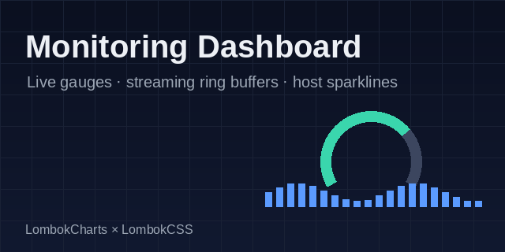
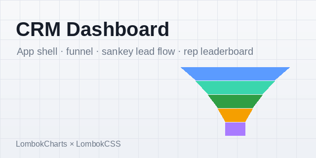
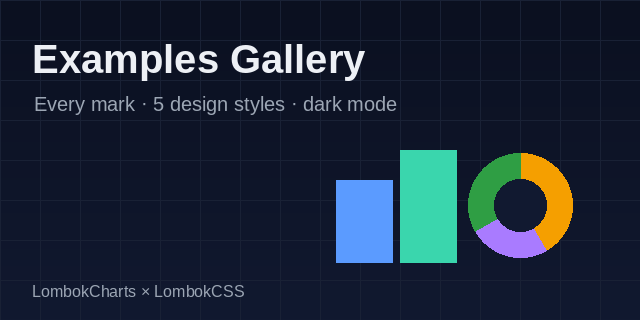
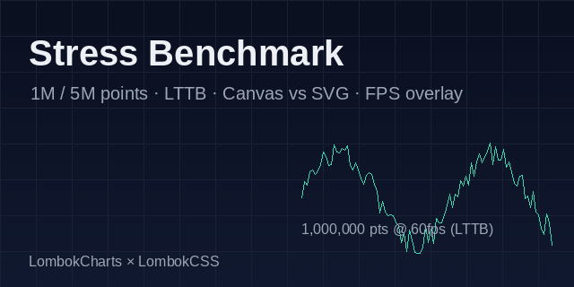

# LombokCharts

[](https://github.com/codinglombok/LombokCharts/actions/workflows/ci.yml)
[](https://github.com/codinglombok/LombokCharts/actions/workflows/linter.yml)
[](https://github.com/codinglombok/LombokCharts/actions/workflows/pages.yml)
[](https://www.npmjs.com/package/lombok-charts)
[](https://www.npmjs.com/package/lombok-charts)
[](https://www.jsdelivr.com/package/npm/lombok-charts)
[](#)
[](LICENSE)
[](https://sourceforge.net/projects/lombokcharts/files/latest/download)
<!-- Begin  Tag -->
<div class="sf-root" data-id="4111149" data-badge="oss-users-love-us-white" style="width:125px">
    <a href="https://sourceforge.net/projects/lombokcharts/" target="_blank">LombokCharts</a>
</div>
<script>(function () {var sc=document.createElement('script');sc.async=true;sc.src='https://b.sf-syn.com/badge_js?sf_id=4111149';var p=document.getElementsByTagName('script')[0];p.parentNode.insertBefore(sc, p);})();
</script>
<!-- End  Tag -->


A zero-dependency charting library for the browser. It pairs a small grammar-of-graphics
core (Data → Scale → Mark) with pluggable Canvas and SVG renderers, LTTB decimation, and a
real-time streaming layer — so the same API draws a five-point bar chart or a five-million-point
line without changing shape.


- **Zero runtime dependencies.** Native Canvas2D / SVG / `ResizeObserver` / `requestAnimationFrame` / typed arrays only.
- **Two renderers, one API.** Canvas by default (fast path for huge series), SVG when you want crisp vector output or DOM-inspectable nodes.
- **Scales from tiny to massive.** Typed-array pipeline plus Largest-Triangle-Three-Buckets (LTTB) decimation keeps million-point series interactive.
- **Real-time built in.** `appendData`, async iterators, `EventSource`, or `WebSocket`, with a ring buffer for constant-memory sliding windows. Redraws are coalesced to one per frame.
- **Tree-shakeable.** Register only the marks you use and the rest is dropped by your bundler.
- **~18 KB gzipped** for the full build with every mark registered; far less for a custom subset.

> Status: `0.1.0`, early but functional. The full test suite and all five build targets pass.

[](https://codinglombok.github.io/LombokCharts/)


| | |
| --- | --- |
| [](https://codinglombok.github.io/LombokCharts/templates/trading-dashboard/index.html) | [](https://codinglombok.github.io/LombokCharts/templates/analytics-dashboard/index.html) |
| [](https://codinglombok.github.io/LombokCharts/templates/monitoring-dashboard/index.html) | [](https://codinglombok.github.io/LombokCharts/templates/crm-dashboard/index.html) |
| [](https://codinglombok.github.io/LombokCharts/examples/index.html) | [](https://codinglombok.github.io/LombokCharts/examples/stress.html) |


## Install

```bash
npm install lombok-charts
# or: pnpm add lombok-charts  /  yarn add lombok-charts
```

```js
import { chart } from 'lombok-charts';

chart('#app', {
  data: [
    { label: 'Q1', value: 120 },
    { label: 'Q2', value: 200 },
    { label: 'Q3', value: 150 },
    { label: 'Q4', value: 280 },
  ],
  mark: 'bar',
  title: 'Quarterly Revenue',
});
```

### CDN (jsDelivr)

- From npm:
```html
<script src="https://cdn.jsdelivr.net/npm/lombok-charts/dist/lombok-charts.umd.min.js"></script>
```
OR 
```html
<script src="https://cdn.jsdelivr.net/npm/lombok-charts@0.1.1/dist/lombok-charts.umd.min.js"></script>
```
 - From GitHub (works before an npm release, since `dist/` is committed):
```html
https://cdn.jsdelivr.net/gh/codinglombok/LombokCharts@v0.1.0/dist/lombok-charts.umd.min.js
```
  
### Via `<script>` (no build step)

The UMD build attaches a global `LombokCharts`:

```html
<script src="https://cdn.jsdelivr.net/npm/lombok-charts/dist/lombok-charts.umd.min.js"></script>
```
OR
```html
<script src="https://cdn.jsdelivr.net/npm/lombok-charts/dist/lombok-charts.umd.min.js"></script>
<script>
  LombokCharts.chart('#app', { data: [{label:'A',value:10}], mark: 'bar' });
</script>
```
OR
Type UMD :
```html
<script src="https://cdn.jsdelivr.net/npm/lombok-charts@0.1.1/dist/lombok-charts.umd.min.js"></script>
```
OR
Type ESM :
```html
<script type="module"> import lombokCharts from 'https://cdn.jsdelivr.net/npm/lombok-charts@0.1.1/+esm' </script>
```


### Also available on unpkg: 
```bashh
https://unpkg.com/lombok-charts/dist/lombok-charts.umd.min.js
```

### Composer (Packagist)

For PHP projects that want the built assets in `vendor/`:

```bash
composer require codinglombok/lombok-charts
```

Then reference `vendor/codinglombok/lombok-charts/dist/lombok-charts.umd.min.js`.


## Chart types

| Family | Marks |
| --- | --- |
| Bar | column, horizontal bar, grouped, stacked, waterfall |
| Line | line, step, spline (Catmull-Rom), slope |
| Area | area, stacked, streamgraph |
| Point | scatter, bubble |
| Arc | pie, donut, gauge, radial bar |
| Statistical | histogram, box plot |
| Financial | candlestick (OHLC) |
| Specialized | radar, heatmap, funnel, treemap, sankey |

Pick a mark with the `mark` option, either as a shorthand string (`'donut'`, `'stacked-bar'`,
`'spline'`) or as an object with extra settings (`{ type: 'gauge', value: 72, min: 0, max: 100 }`).

## Quick examples

Multi-series line from row objects:

```js
chart('#chart', {
  data: rows,                 // [{ month:'Jan', sales: 10, cost: 6 }, ...]
  x: 'month',
  series: [
    { key: 'sales', label: 'Sales' },
    { key: 'cost',  label: 'Cost' },
  ],
  mark: 'line',
});
```

A large series from typed arrays (skips object overhead entirely):

```js
const xs = new Float64Array(n), ys = new Float64Array(n);
// ...fill...
chart('#chart', { xs, ys, count: n, mark: 'line' }); // LTTB kicks in automatically
```

Real-time stream with a sliding window:

```js
const c = chart('#chart', { mark: 'line', maxPoints: 2000 });
setInterval(() => c.appendData({ x: Date.now(), y: read() }), 16);
// or: c.stream(new WebSocket('wss://…'), (msg) => ({ x: msg.t, y: msg.v }));
```

Export and theming:

```js
c.setTheme('dark');
const png = c.toPNG();   // data URL
const svg = c.toSVG();   // serialized <svg> markup
```

## Performance

The Canvas renderer has a typed-array fast path (`polylineTyped` / `pointsTyped`) that avoids
per-point allocations, and line/area/scatter marks decimate with LTTB when the series has more
points than the plot has horizontal pixels to show them. Spikes and outliers survive decimation
because LTTB selects the point that maximizes triangle area per bucket. Animation is disabled
automatically above 50,000 points so the first paint stays responsive.

Real numbers depend heavily on the machine, GPU, and viewport, so rather than ship fabricated
figures the repo includes a live benchmark: open [`examples/stress.html`](examples/stress.html),
choose 100k / 1M / 5M points, toggle LTTB on/off, switch Canvas vs SVG, and read FPS, initial
render time, and the drawn-point count off the overlay. The "Compare Canvas vs SVG" button fills
a table you can record for your own hardware.

General guidance from the design:

- **Canvas + LTTB** is the right default for anything above a few thousand points; it stays
  interactive into the millions because the number of points actually rasterized is bounded by
  the pixel width, not the dataset size.
- **Raw (non-decimated) Canvas** is fine into the hundreds of thousands and degrades gracefully.
- **SVG** is best below a few thousand points or when you need vector output; it is not the tool
  for raw million-point series (one DOM-scale path per frame), so the benchmark decimates for it.

## Bundle size

| Build | File | Raw | Gzipped |
| --- | --- | --- | --- |
| ESM (min) | `dist/lombok-charts.esm.min.js` | ~56 KB | ~18 KB |
| UMD (min) | `dist/lombok-charts.umd.min.js` | ~56 KB | ~18 KB |

These cover the **full** library with all 13 marks registered. Importing `Chart` plus only the
marks you need lets your bundler tree-shake the rest for a smaller footprint.

## API at a glance

```
chart(container, config) -> Chart        // factory; same as new Chart(container, config)

Chart#render()                           // (re)draw, animating on first paint
Chart#update(data | { xs, ys, count })   // replace data and redraw
Chart#appendData(point | point[])        // live append (coalesced to one redraw/frame)
Chart#stream(source, map?)               // async iterator | EventSource | WebSocket
Chart#setTheme('light' | 'dark' | {...}) // swap theme tokens (deep-merged)
Chart#resize()                           // re-measure container (also automatic via ResizeObserver)
Chart#toPNG() / Chart#toSVG()            // export
Chart#on('hover' | 'select' | 'append', fn)
Chart#destroy()                          // remove listeners, observers, DOM
```

Full reference: [`docs/api.md`](docs/api.md). Theming: [`docs/theming.md`](docs/theming.md).
Internals and how to add a mark: [`docs/architecture.md`](docs/architecture.md). Porting the
pure-logic core to other languages: [`docs/porting.md`](docs/porting.md).

## Development

```bash
npm install      # dev-only: esbuild
npm run build    # -> dist/ (esm, esm.min, umd, umd.min, cjs)
npm test         # zero-dependency test runner (unit + headless DOM smoke)
npm run dev      # watch build
```

The build output is committed-free (`dist/` is git-ignored); CI rebuilds on every push. The test
suite runs pure-logic checks (scales, LTTB, ring buffer, quadtree) plus an end-to-end pipeline
test under a tiny headless DOM/Canvas shim, so integration regressions are caught without a browser.

## Roadmap

- WebGL renderer (the renderer interface already isolates the drawing surface; a stub marks the seam).
- More statistical marks (violin, density, OHLC volume overlay).
- Declarative axis/legend configuration surface.
- Published, machine-specific benchmark results once the API stabilizes.

## License

Apache-2.0 © codinglombok — see [LICENSE](LICENSE) and [NOTICE](NOTICE).
This project is licensed under the Apache License 2.0 - see the [LICENSE](LICENSE) file for details.
