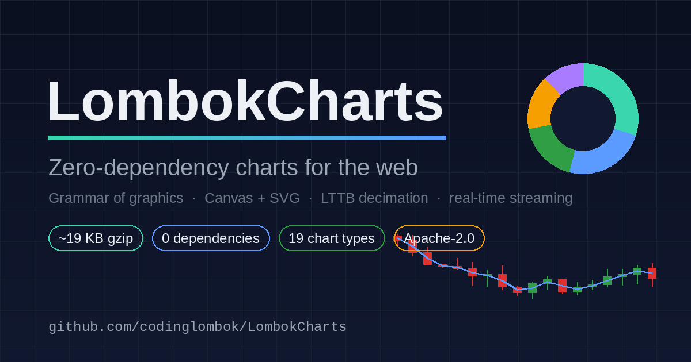
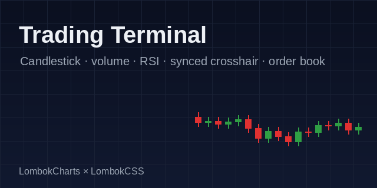
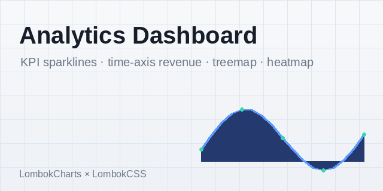
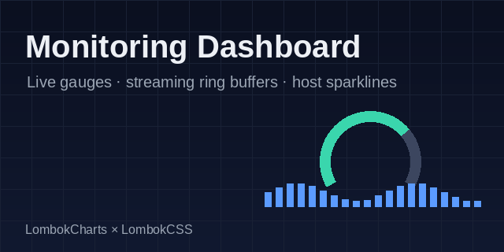
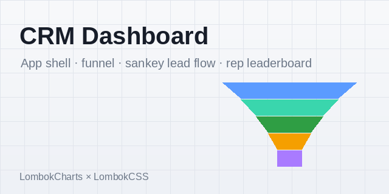
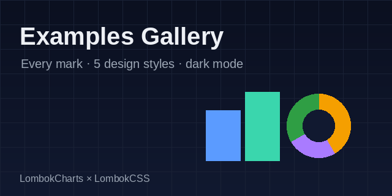
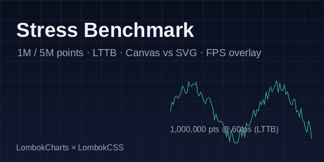

# LombokCharts

---

## GitHub

[](https://github.com/codinglombok/LombokCharts/actions/workflows/ci.yml)
[](https://github.com/codinglombok/LombokCharts/actions/workflows/linter.yml)
[](https://github.com/codinglombok/LombokCharts/actions/workflows/codeql.yml)
[](https://github.com/codinglombok/LombokCharts/actions/workflows/pages.yml)
[](LICENSE)

---

## npm

[](https://www.npmjs.com/package/lombok-charts)
[](https://www.npmjs.com/package/lombok-charts)
[](https://www.jsdelivr.com/package/npm/lombok-charts)


---

## Quality

[](#)
[](#)
[](#)
[](#)
[](#)
[](#)

---

## SourceForge

[](https://sourceforge.net/projects/lombokcharts/files/latest/download)
[](https://sourceforge.net/projects/lombokcharts/files/latest/download)
[](https://sourceforge.net/projects/lombokcharts/files/latest/download)
[](https://sourceforge.net/projects/lombokcharts/files/latest/download)
[](https://sourceforge.net/projects/lombokcharts/files/latest/download)

---

## Packagist

[](https://packagist.org/packages/codinglombok/lombok-charts)
[](https://packagist.org/packages/codinglombok/lombok-charts)
[](https://packagist.org/packages/codinglombok/lombok-charts)

---

## Community

[](https://github.com/codinglombok/LombokCharts/issues)
[](https://github.com/codinglombok/LombokCharts/pulls)
[](https://github.com/codinglombok/LombokCharts/commits/main)
[](https://github.com/codinglombok/LombokCharts)
[](https://github.com/codinglombok/LombokCharts/fork)

---

A zero-dependency charting library for the browser. It pairs a small grammar-of-graphics
core (Data → Scale → Mark) with pluggable Canvas and SVG renderers, LTTB decimation, and a
real-time streaming layer — so the same API draws a five-point bar chart or a five-million-point
line without changing shape.

- **Zero runtime dependencies.** Native Canvas2D / SVG / `ResizeObserver` / `requestAnimationFrame` / typed arrays only.
- **Two renderers, one API.** Canvas by default (fast path for huge series), SVG when you want crisp vector output or DOM-inspectable nodes.
- **Scales from tiny to massive.** Typed-array pipeline plus Largest-Triangle-Three-Buckets (LTTB) decimation keeps million-point series interactive.
- **Real-time built in.** `appendData`, async iterators, `EventSource`, or `WebSocket`, with a ring buffer for constant-memory sliding windows.
- **Tree-shakeable.** Register only the marks you use and the rest is dropped by your bundler.
- **~18 KB gzipped** for the full build with every mark registered; far less for a custom subset.

> **Current version: 0.1.2** — early but functional. All tests pass, published on npm and jsDelivr.

[](https://codinglombok.github.io/LombokCharts/)

|                                                                                                                                                  |                                                                                                                                               |
| ------------------------------------------------------------------------------------------------------------------------------------------------ | --------------------------------------------------------------------------------------------------------------------------------------------- |
| [](https://codinglombok.github.io/LombokCharts/templates/trading-dashboard/index.html)           | [](https://codinglombok.github.io/LombokCharts/templates/analytics-dashboard/index.html) |
| [](https://codinglombok.github.io/LombokCharts/templates/monitoring-dashboard/index.html) | [](https://codinglombok.github.io/LombokCharts/templates/crm-dashboard/index.html)                   |
| [](https://codinglombok.github.io/LombokCharts/examples/index.html)                             | [](https://codinglombok.github.io/LombokCharts/examples/stress.html)                           |

## Quick Start

### npm / bundler

```bash
npm install lombok-charts
```

```js
import { chart } from "lombok-charts";

chart("#app", {
  mark: "bar",
  data: [
    { label: "Q1", value: 120 },
    { label: "Q2", value: 200 },
    { label: "Q3", value: 150 },
    { label: "Q4", value: 280 },
  ],
  title: "Quarterly Revenue",
});
```

### CDN (no build step)

```html
<div id="app" style="width:600px; height:400px"></div>
<script src="https://cdn.jsdelivr.net/npm/lombok-charts/dist/lombok-charts.umd.min.js"></script>
<script>
  LombokCharts.chart("#app", {
    mark: "bar",
    data: [
      { label: "Q1", value: 120 },
      { label: "Q2", value: 200 },
      { label: "Q3", value: 150 },
      { label: "Q4", value: 280 },
    ],
  });
</script>
```

Other CDN options (pinned version, ESM, unpkg) are listed in [`DISTRIBUTION.md`](DISTRIBUTION.md).

### Composer (PHP projects)

```bash
composer require codinglombok/lombok-charts
```

Then reference `vendor/codinglombok/lombok-charts/dist/lombok-charts.umd.min.js` in your HTML.

## Chart Types

| Family      | Marks                                               |
| ----------- | --------------------------------------------------- |
| Bar         | column, horizontal bar, grouped, stacked, waterfall |
| Line        | line, step, spline (Catmull-Rom), slope             |
| Area        | area, stacked, streamgraph                          |
| Point       | scatter, bubble                                     |
| Arc         | pie, donut, gauge, radial bar                       |
| Statistical | histogram, box plot                                 |
| Financial   | candlestick (OHLC)                                  |
| Specialized | radar, heatmap, funnel, treemap, sankey             |

Pick a mark with the `mark` option: a shorthand string (`'donut'`, `'stacked-bar'`, `'spline'`)
or an object with extra settings (`{ type: 'gauge', value: 72, min: 0, max: 100 }`).

## Examples

**Multi-series line:**

```js
chart("#chart", {
  mark: "line",
  data: rows, // [{ month:'Jan', sales: 10, cost: 6 }, ...]
  x: "month",
  series: [
    { key: "sales", label: "Sales" },
    { key: "cost", label: "Cost" },
  ],
});
```

**Donut chart:**

```js
chart("#chart", {
  mark: "donut",
  data: [
    { label: "Mobile", value: 58 },
    { label: "Desktop", value: 32 },
    { label: "Tablet", value: 10 },
  ],
});
```

**Large dataset with typed arrays (LTTB kicks in automatically):**

```js
const xs = new Float64Array(1_000_000);
const ys = new Float64Array(1_000_000);
// ...fill...
chart("#chart", { mark: "line", xs, ys, count: 1_000_000 });
```

**Real-time stream with sliding window:**

```js
const c = chart("#chart", { mark: "line", maxPoints: 2000 });
setInterval(() => c.appendData({ x: Date.now(), y: read() }), 16);
// or: c.stream(new WebSocket('wss://…'), (msg) => ({ x: msg.t, y: msg.v }));
```

**Theming and export:**

```js
c.setTheme("dark");
const png = c.toPNG(); // data URL
const svg = c.toSVG(); // serialized <svg> markup
```

## API at a Glance

```javascript
chart(container, config) -> Chart        // factory; same as new Chart(container, config)

Chart#render()                           // (re)draw, animating on first paint
Chart#update(data | { xs, ys, count })   // replace data and redraw
Chart#appendData(point | point[])        // live append (coalesced to one redraw/frame)
Chart#stream(source, map?)               // async iterator | EventSource | WebSocket
Chart#setTheme('light' | 'dark' | {...}) // swap theme tokens (deep-merged)
Chart#resize()                           // re-measure container (also automatic via ResizeObserver)
Chart#toPNG() / Chart#toSVG()            // export
Chart#on('hover' | 'select' | 'append', fn)
Chart#destroy()                          // remove listeners, observers, DOM
```

Full reference: [`docs/api.md`](docs/api.md). Theming: [`docs/theming.md`](docs/theming.md).
Internals and how to add a mark: [`docs/architecture.md`](docs/architecture.md). Porting the
pure-logic core to other languages: [`docs/porting.md`](docs/porting.md).

## Performance

The Canvas renderer has a typed-array fast path (`polylineTyped` / `pointsTyped`) that avoids
per-point allocations, and line/area/scatter marks decimate with LTTB when the series has more
points than the plot has horizontal pixels to show them. Animation is disabled automatically above
50,000 points so the first paint stays responsive.

General guidance: **Canvas + LTTB** is the default for anything above a few thousand points;
**SVG** is best below a few thousand or when you need vector output. The repo includes a live
benchmark at [`examples/stress.html`](examples/stress.html) — choose 100k / 1M / 5M points,
toggle LTTB, and switch Canvas vs SVG.

## Bundle Size

| Build     | File                            | Raw    | Gzipped |
| --------- | ------------------------------- | ------ | ------- |
| ESM (min) | `dist/lombok-charts.esm.min.js` | ~56 KB | ~18 KB  |
| UMD (min) | `dist/lombok-charts.umd.min.js` | ~56 KB | ~18 KB  |

These cover the **full** library with all 13 marks registered. Importing `Chart` plus only the
marks you need lets your bundler tree-shake the rest for a smaller footprint.

## Development

```bash
npm install      # dev-only: esbuild
npm run build    # -> dist/ (esm, esm.min, umd, umd.min, cjs)
npm test         # zero-dependency test runner (unit + headless DOM smoke)
npm run dev      # watch build
```

The `dist/` folder is committed so that Composer, jsDelivr-from-GitHub, and `<script>` users can
consume it without a build step; CI regenerates it on every push to keep it in sync with `src/`.

## Roadmap

See [`ROADMAP.md`](ROADMAP.md) for the full 0.1 → 1.0 plan. Next priorities:

- Visual regression testing with Playwright (0.2)
- TypeScript declarations and API hardening (0.3)
- Full ARIA accessibility and keyboard navigation (0.4)
- WebGL renderer for extreme point counts (0.5)
- Framework wrappers: React, Vue, Svelte, Angular (0.6)

## License

Apache-2.0 © codinglombok — see [LICENSE](LICENSE) and [NOTICE](NOTICE).
